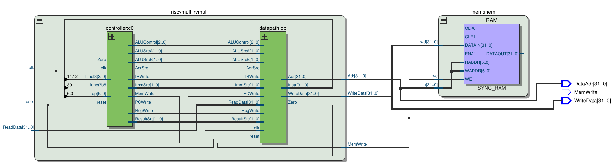
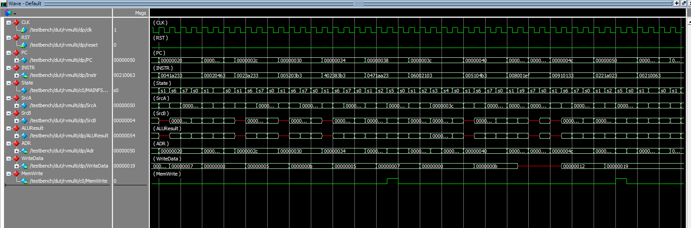
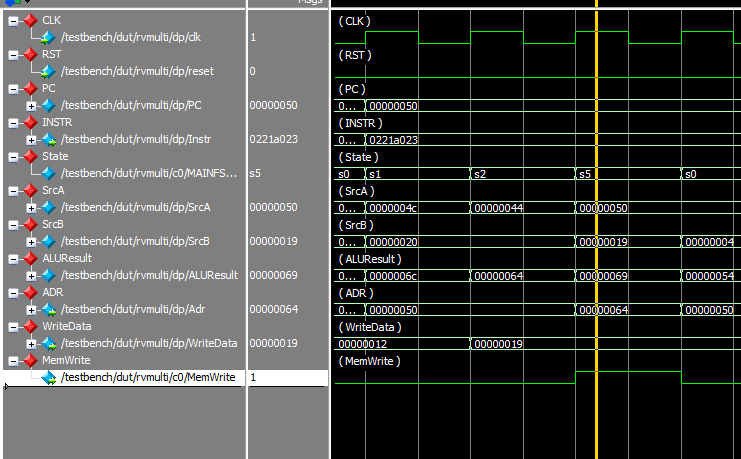

# RISC-V-Complete-Multicycle-Processor Design
***
This project contains the files related to design and simulation of complete risc-v multicycle processor in system-verilog, system block diagram and test results. 
Unlike single-cycle risc-v processor which use separate instruction memory and a data memory, a complete RISC-V processor uses combined memory for them. The combined memory appraoch is more realistic because we can read the instruction in one cycle and then read or write data.
 
Following is the block diagram of RISC-V complete multicycle processor. Here we can see the building block of the processor like control unit, register file unit, memory unit, data path and so on.
 
*Complete multicycle MIPS processor* 
Here the following block shows more generic view of the processor.
 
*RISC-V Multicycle processor interfaced to memory*
***
In this project, all the functionalities of the processor are implemented in the system-verilog. The design is tested with a simple assembly program. Check out [riscvtest.txt](Src/riscvtest.txt) which contains the machine code of the code. The designed processor is capable of running **addi** instruction and so on. Some more complex branching instrution requires slide modification in the implementation and design. 
The design was tested in the Quartus and the following Schematic result was obtained.
Following are the waveform obtained after simulating the design in the Model-Simulator. 

 
Here, in the more closer look of the simulation waveform, we can see that 25 has been written to the memory address 100.
***
Dev@2024
IOE, Pulchowk Campus
***
